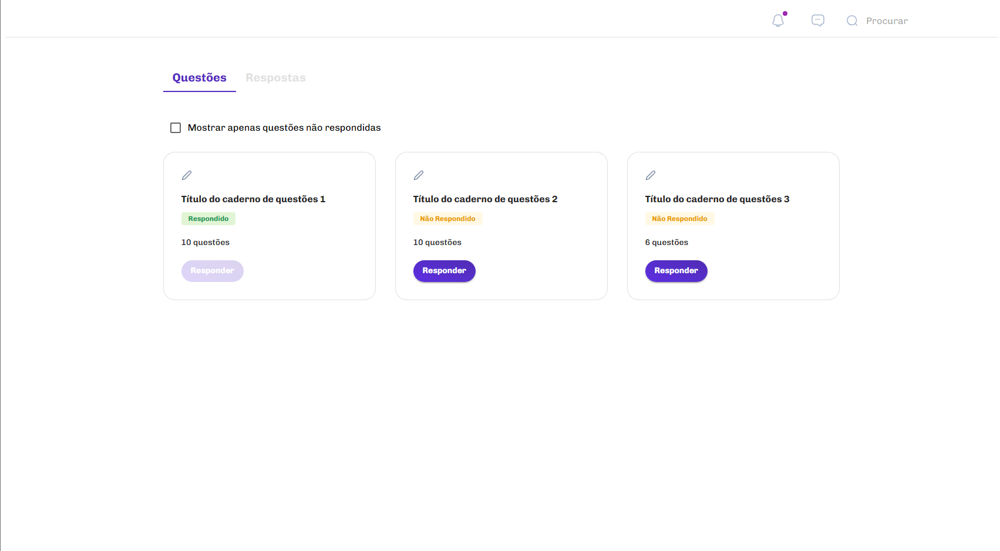

<h1 align="center">Caderno de Questões</h1>

## Introduction

This is a web application that lists question books for tests.




## Technologies

- [React](https://reactjs.org/)
- [Next.js](https://nextjs.org/)
- [TypeScript](https://www.typescriptlang.org/)
- [ESLint](https://eslint.org/)
- [Material UI](https://mui.com/)


## Installation

1. Clone the repository
```bash
git clone https://github.com/Pedro2091/caderno-de-questoes
```

2. Run npm install to install the packages
```bash
npm install
```

## How to run the Aplication in development (Don't forget to run API)

1. Run the server in the folder terminal
```bash
npm run dev
```

## How to run the API

1. Run the server in another terminal
```bash
npm run api
```

## How to build and run the Aplication in production

1. Build the aplication in folder terminal
```bash
npm run build
```
2. Run the server
```bash
npm run start
```

